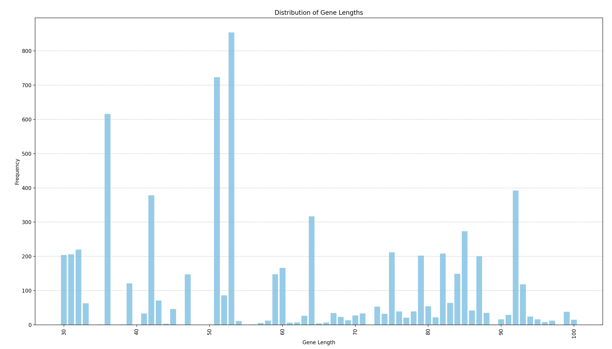
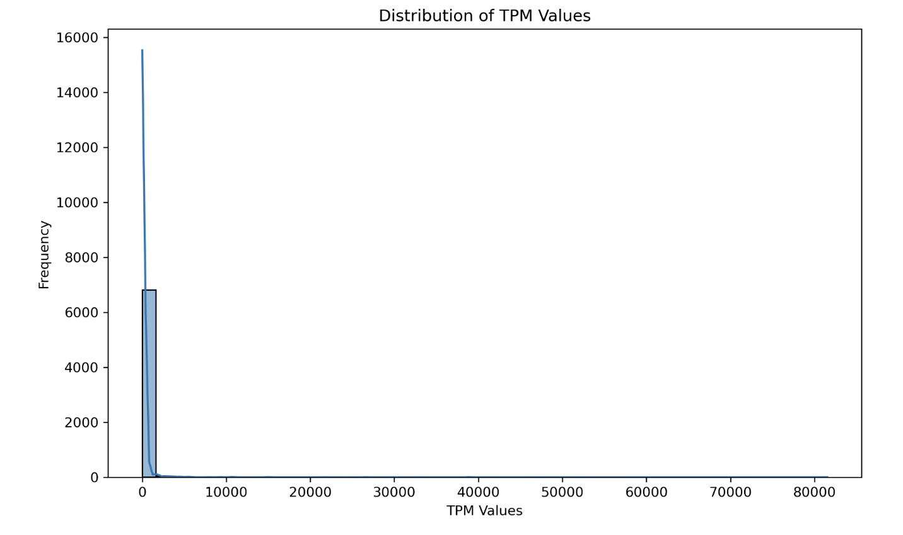
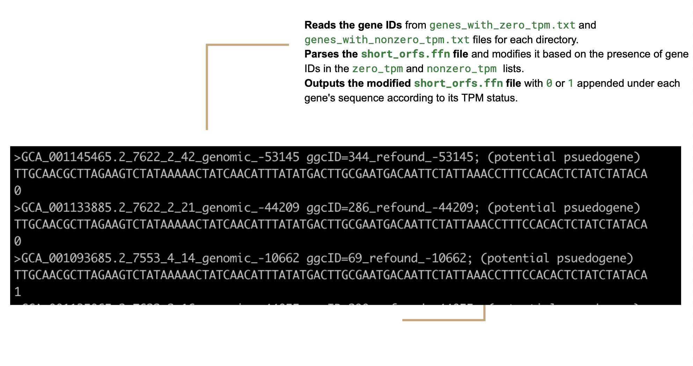

# Small ORF Expression Prediction Model


- [Overview](#overview)
- [Project Workflow](#project-workflow)
  - [1. Gene Identification with ggCaller](#1-gene-identification-with-ggcaller)
  - [2. Transcript Alignment with Kallisto](#2-transcript-alignment-with-kallisto)
  - [3. Kallisto Output Analysis](#3-kallisto-output-analysis)
  - [4. Labeling Genes for Model Training](#4-labeling-genes-for-model-training)
  - [5. Final Training File](#5-final-training-file)
- [Next Steps](#next-steps)
- [Reading for this project](#Reading-for-this-project)

## Overview

This project aims to develop a machine learning model to predict the expression of small Open Reading Frames (sORFs). Small ORFs are typically challenging to identify and predict due to their short length, but they play a significant role in various biological processes. By accurately predicting which sORFs are expressed, we can gain insights into their functional roles in the genome.

## Project Workflow

### 1. Gene Identification with ggCaller

The initial step in the project involved identifying potential small ORFs from a dataset of **616 pneumococcal genomes** sourced from [here](https://www.nature.com/articles/sdata201558). The following steps were performed:

- **Tool Used:** [ggCaller]([https://github.com/ghoresh11/ggCaller](https://github.com/bacpop/ggCaller))
- **Parameters:**
  - `--min-orf-length` = 19
  - `--min-orf-score` = 19

The ggCaller was used to predict small ORFs from these genomes. After running ggCaller, a total of **6,013 genes** were predicted.

Here is the distribution of the genes after filtering the long ORFs:



### 2. Transcript Alignment with Kallisto

The next step was to align the transcripts from the study [Aprianto R et al. 2018](https://pubmed.ncbi.nlm.nih.gov/30165663/) to the identified small ORFs to determine which of these ORFs are expressed.

- **Tool Used:** [Kallisto](https://pachterlab.github.io/kallisto/about)
- **Index File:** `short_ORFs.ffn`
- **Parameters:**
  - `kmer length` = 19

The alignment was performed using the cDNA expression data from the study. The dataset was accessed from the [European Nucleotide Archive (ENA)](https://www.ebi.ac.uk/ena/browser/view/PRJNA422256?show=reads).

### 3. Kallisto Output Analysis

After the alignment, the output from Kallisto was analyzed, specifically focusing on the `abundance.tsv` file. 

Metrics in aboudance.tsv file are : 

- **eff_length:** The effective length of the transcript, considering the fragment length distribution.
- **est_counts:** The estimated number of reads derived from this transcript.

but The key metric for our analysis is:


- **TPM (Transcripts Per Million):** A normalized measure of transcript abundance, allowing comparison of transcript levels within and between samples.
#### TPM Calculation:

1. **RPK (Reads Per Kilobase):** Divide the read counts by the length of each gene in kilobases.
2. **Per Million Scaling Factor:** Count up all the RPK values in a sample and divide by 1,000,000.
3. **TPM:** Divide the RPK values by the “per million” scaling factor.

**Note:** TPM is preferred over RPKM/FPKM because it ensures that the sum of TPMs in each sample is the same, making cross-sample comparisons more reliable.

Here is a distribution of TPM values:



### 4. Labeling Genes for Model Training

To determine whether a gene is expressed (True) or not (False), a TPM cutoff of **0** was used.

- **True Genes:** Genes with a TPM > 0.
- **False Genes:** Genes with a TPM = 0.

The following steps were taken:

- Gene IDs were read from `genes_with_zero_tpm.txt` and `genes_with_nonzero_tpm.txt` files.
- The `short_orfs.ffn` file was parsed, and each gene's sequence was modified based on its TPM status.
- The output was a modified `short_orfs.ffn` file with `0` (False) or `1` (True) appended under each gene's sequence.

### 5. Final Training File

The final training file, which will be used to train the machine learning model, looks something like this:

```plaintext
>gene_1
ATGCGT...TTGA
0

>gene_2
ATGCCA...TCAA
1
```
This file includes the sequence of each gene followed by a label indicating whether the gene is expressed (1) or not (0).




## Next Steps

As I'm still working on this project the next steps will be : 

- Model Training: The labeled dataset will be used to train a machine learning model, CNN as our model 1, and also BERT as our model 2.
- Model Evaluation: The model will be evaluated using various metrics to ensure its accuracy and reliability in predicting small ORF expression.
- Model Deployment: The final model will be shared as part of this repository.


# Bibliography and Related Articles

## Readings for this project


### Population Genomic Datasets

- **Title:** Population Genomic Datasets Describing the Post-Vaccine Evolutionary Epidemiology of *Streptococcus pneumoniae*
- **Link:** [Nature Scientific Data](https://www.nature.com/articles/sdata201558)

### Transcriptome Analysis

- **Title:** High-Resolution Analysis of the Pneumococcal Transcriptome Under a Wide Range of Infection-Relevant Conditions
- **Link:** [PubMed](https://pubmed.ncbi.nlm.nih.gov/30165663/)

### Genomic Language Models

- **Title:** ProkBERT Family: Genomic Language Models for Microbiome Applications
- **Link:** [Frontiers in Microbiology](https://www.frontiersin.org/journals/microbiology/articles/10.3389/fmicb.2023.1331233/full)

- **Title:** DNABERT: Pre-trained Bidirectional Encoder Representations from Transformers Model for DNA-language in Genome
- **Link:** [Bioinformatics Journal](https://academic.oup.com/bioinformatics/article/37/15/2112/6128680)

### Small ORFs and Microproteins

- **Title:** sORFdb – A Database for sORFs, Small Proteins, and Small Protein Families in Bacteria
- **Link:** [bioRxiv](https://www.biorxiv.org/content/10.1101/2024.06.19.599710v1)

- **Title:** Short Open Reading Frames (sORFs) and Microproteins: An Update on Their Identification and Validation Measures
- **Link:** [Journal of Biomedical Science](https://jbiomedsci.biomedcentral.com/articles/10.1186/s12929-022-00802-5#:~:text=A%20short%20open%20reading%20frame,comprises%20)

### DNA Sequence Classification

- **Title:** DNA Sequence Classification by Convolutional Neural Network
- **Link:** [ResearchGate](https://www.researchgate.net/publication/301703031_DNA_Sequence_Classification_by_Convolutional_Neural_Network)

### Machine Learning in Genomics

- **Title:** Apply Machine Learning Algorithms for Genomics Data Classification
- **Authors:** Ernest Bonat, Ph.D., Bishes Rayamajhi, MS.
- **Date:** February 03, 2021

- **Title:** Advanced DNA Sequence Text Classification Using Natural Language Processing
- **Link:** [Ernest Bonat on Medium](https://ernest-bonat.medium.com/advanced-dna-sequence-text-classification-using-natural-language-processing-8860c3c05692)

### BERT and Deep Learning Resources

- **Title:** Slides for BERT, Stanford
- **Link:** [Stanford NLP Seminar](https://nlp.stanford.edu/seminar/details/jdevlin.pdf)

- **Title:** Deep Learning in Genomics Primer (Tutorial)
- **Link:** [GitHub Tutorial](https://github.com/abidlabs/deep-learning-genomics-primer/blob/master/A_Primer_on_Deep_Learning_in_Genomics_Public.ipynb)

- **Title:** Application of BERT to Enable Gene Classification Based on Clinical Evidence
- **Link:** [NCBI](https://www.ncbi.nlm.nih.gov/pmc/articles/PMC7563092/)


